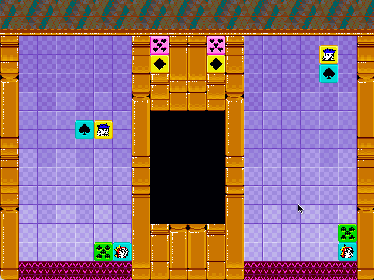
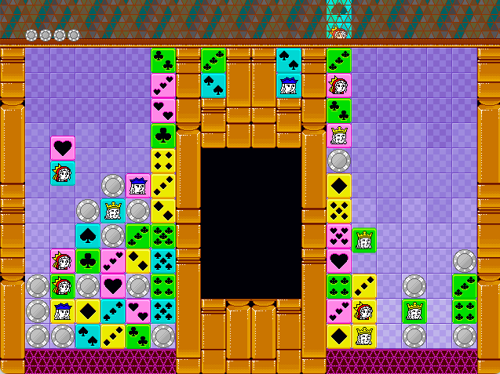
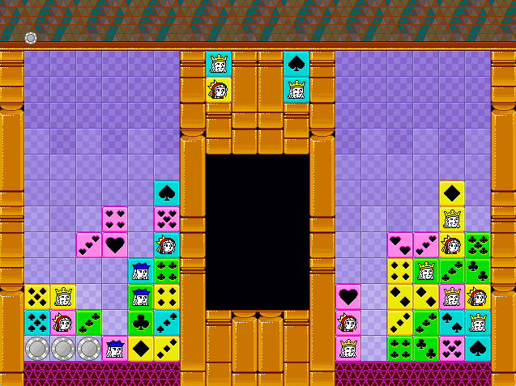

#  PuzzleSuit
PuzzleSuit is a tile-matching videogame where you make tiles disappear by making Poker hands.

You can make combo to send chips to your opponent.

A big combo can KO your opponent in one shot!

PuzzleSuit is written in Swift and can only be played on macOS.
